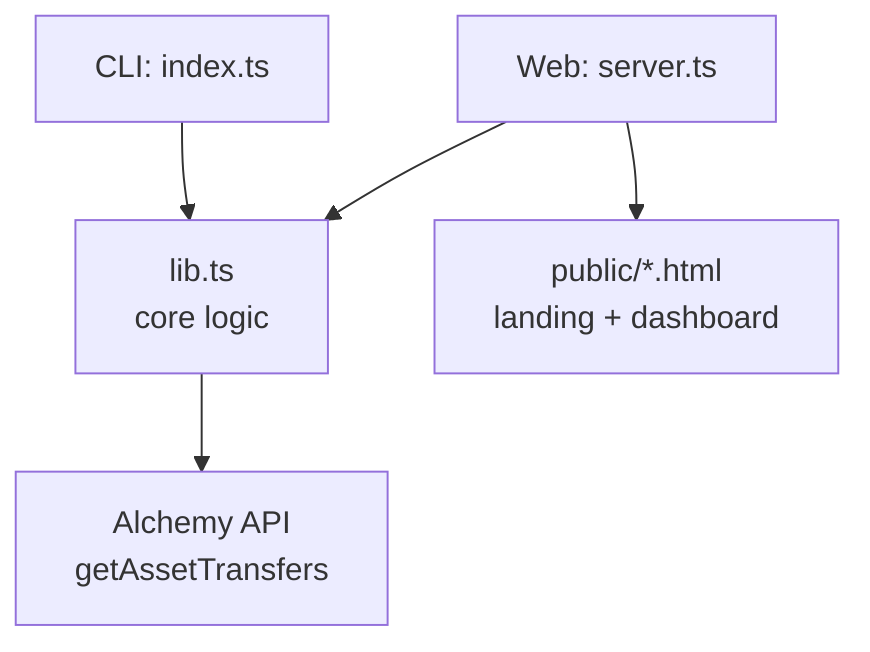

# ETH Transfer Explorer

A tool that fetches an Ethereum address's **complete, correctly-paginated transfer history** using Alchemy's `alchemy_getAssetTransfers` API — available as both a CLI tool and a web dashboard.

Built for the "Wallet That Won't Explain Itself" challenge — paste any address, get back its real, complete activity feed across all transfer types and both directions, with no silent truncation.

## Tech Stack

- **Runtime:** Node.js + TypeScript
- **Blockchain data:** Alchemy SDK (`alchemy_getAssetTransfers`)
- **Backend API:** Express.js
- **Frontend:** Vanilla HTML/CSS/JS (Neo-Brutalist design, Tailwind CDN)
- **CLI:** ts-node

## Architecture


- **`src/lib.ts`** — shared core logic: paginated fetching, retry/backoff, address validation, category/direction handling. Used by both entry points.
- **`src/index.ts`** — CLI entry point. Prints console preview + writes full history to a file.
- **`src/server.ts`** — Express API (`GET /api/transfers/:address`) + serves the static dashboard.
- **`public/landing.html`** — intro/marketing page.
- **`public/index.html`** — interactive dashboard (search, stats, category filters, transaction table).

## Setup

1. Install dependencies:
```bash
   npm install
```
2. Add your Alchemy API key to `.env`:
```env
   ALCHEMY_API_KEY=your_api_key_here
```

## Usage

### CLI
```bash
npm start -- <ethereum-address>
```
Example:
```bash
npm start -- 0xd8dA6BF26964aF9D7eEd9e03E53415D37aA96045
```

### Web Dashboard
```bash
npm run server
```
Then open **http://localhost:3001** in your browser. Paste an address into the search bar to see live stats, category breakdown, top assets, and transaction history.

## What It Does

- **5 transfer categories**: external (ETH), internal (ETH), erc20, erc721, erc1155
- **Both directions**: transfers where the address is `fromAddress` (sent) and `toAddress` (received)
- **Full pagination**: loops using `pageKey` until it returns `undefined` — never stops at page 1
- **Retry with exponential backoff**: up to 5 retries per page on network errors (1s/2s/4s/8s/16s delays)
- **Rate-limit friendly**: 300ms delay between successful page requests
- **Address validation**: rejects malformed input before making any API call
- **Chronological ordering**: merged results sorted consistently oldest-to-newest

## Output

**CLI:**
- Console preview: first 20 and last 20 transfers as a human-readable table (date, direction, asset, amount, counterparty, tx hash)
- Full history file: complete transfer feed written to `output/transfers-<address>.txt`
- Summary: total, sent, and received counts

**Dashboard:**
- Live stat cards (total / sent / received / unique counterparties)
- Category breakdown with clickable filters
- Top 5 assets by transfer count
- Scrollable transaction table (most recent 200 transfers)

## Validation

Tested against Vitalik's address:

0xd8dA6BF26964aF9D7eEd9e03E53415D37aA96045 (vitalik.eth)


This address has tens of thousands of transactions across multiple ERC-20s and NFTs. The implementation returns **~500,000+ transfers** across all 5 categories and both directions with full pagination — confirming no truncation. A lazy implementation that only fetches page 1 of one category/direction would show a suspiciously small number; this tool returns the real, complete history.

## Project Structure

```
wallet-explorer/
├── src/
│   ├── lib.ts          # Core fetching/pagination/retry logic
│   ├── index.ts        # CLI entry point
│   └── server.ts       # Express API + static file serving
├── public/
│   ├── landing.html    # Intro page
│   └── index.html      # Dashboard
├── .env.example
├── package.json
└── tsconfig.json
```
